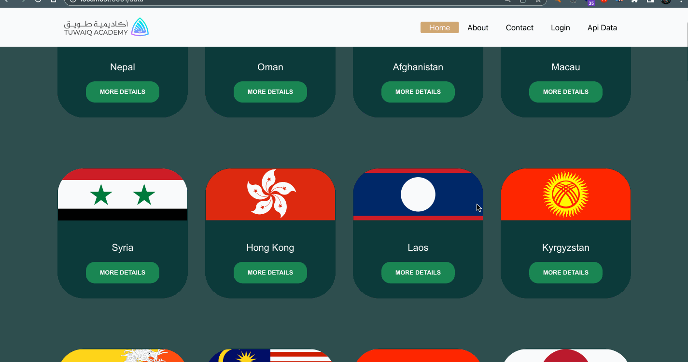

# A mini project using api

Screenshot :

ReactJS functionalities used:

1. Axios for handling asynchronous operations.
2. Outlet.
3. arrow functions.
4. LocalStorage.
5. useParams.
6. useNavigate
7. Routers

Other technologies used:

- HTML
- Bootstrap
- CSS
- JavaScript ES6
- JSX
